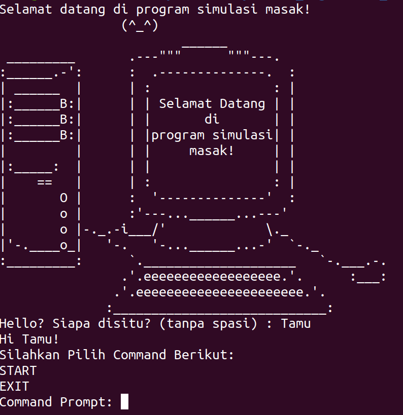
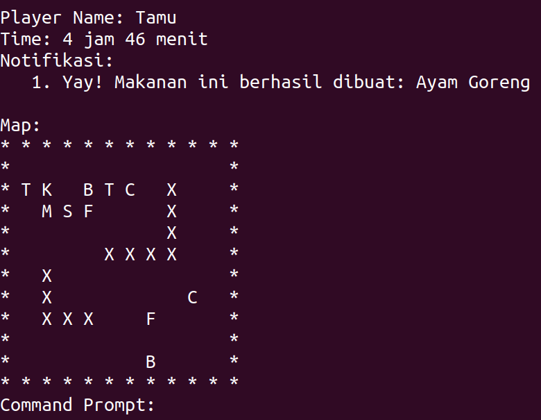

# IF2110_TugasBesar_BNMO-Simulator-Masak

Kelompok G

- 13521110 Yanuar Sano Nur Rasyid  
- 13521123 William Nixon  
- 13521135 Nicholas Liem  
- 13521164 Akhmad Setiawan  
- 13521165 Reza Pahlevi Ubaidillah

## BNMO Simulator Masak

BNMO Simulator Masak merupakan salah satu tugas besar mata kuliah IF2110 Algoritma dan Struktur Data. Tugas ini ditujukan untuk mengimplementasikan seluruh tipe data abstrak (ADT) yang telah dipelajari di kelas.

## Table of Contents

- [IF2110_TugasBesar_BNMO-Simulator-Masak](#if2110_tugasbesar_bnmo-simulator-masak)
  - [BNMO Simulator Masak](#bnmo-simulator-masak)
  - [Table of Contents](#table-of-contents)
  - [General Information](#general-information)
  - [Abstract Data Type yang digunakan](#abstract-data-type-yang-digunakan)
  - [Fitur Program](#fitur-program)
  - [Screenshots](#screenshots)
  - [Setup](#setup)
    - [How to compile?](#how-to-compile)
  - [Cara Pemakaian](#cara-pemakaian)
  - [Project Status](#project-status)
  - [Room for Improvement](#room-for-improvement)

## General Information

Simulasi Masak BNMO merupakan program berbasis CLI (Command-line Interface) yang mensimulasikan bagaimana sebuah resep makanan dapat dibuat, dengan menjalankan command yang tersedia.  
Pada mulanya, program simulator memiliki beberapa bahan makanan sesuai konfigurasi yang ada, untuk kemudian dapat diolah sesuai dengan resep yang bersesuaian.  
Simulator dapat bergerak sepanjang peta untuk melakukan berbagai hal, mulai dari membeli tambahan bahan makanan, mengolah makanan seperti memotong, menggoreng, merebus, dan mencampurkan bahan makanan di tempat tertentu pada peta.  
Program dibuat menggunakan bahasa C dengan mengimplementasikan ADT yang sudah dipelajari pada mata kuliah IF2110 - Algoritma dan Struktur Data.

## Abstract Data Type yang digunakan

- ADT Point
- ADT Time
- ADT Makanan
- ADT Simulator
- ADT List Statik
- ADT Matriks
- ADT Charmachine
- ADT Wordmachine
- ADT Prioqueuedinamik
- ADT Stack
- ADT Tree
- ADT Listlinier
- ADT Peta
- ADT Kulkas
- ADT Set
- ADT Word

## Fitur Program

Aksi yang dapat dilakukan oleh user di dalam program

- Simulasi pengguna dengan nama, waktu, dan posisi di peta
- Simulasi memasak makanan mulai dari delivery, pengolahan sesuai resep yang diberikan, dan sistem kadaluwarsa makanan tersebut
- Sistem inventory untuk menyimpan makanan dan kulkas agar makanan tidak kadaluwarsa 

## Screenshots

Contoh screenshot program





## Setup

Program ini membutuhkan GCC (GNU Complier Collection) dengan versi C11 atau C17.

### How to compile?

1. Clone project ini

    ```console
    > git clone https://github.com/NicholasLiem/IF2110_TugasBesar_BNMO-Simulator-Masak.git
    ```

2. Masuk ke dalam folder utama dan compile programnya

    ```console
    > cd IF2110_TugasBesar_BNMO-Simulator-Masak  
    > gcc -std=c17 -I. src/ADT/{FOLDER}/*.c  src/Helper/{FOLDER}/*.c -o bin/{{MAIN_FILENAME}} {MAIN_FILE} -lm
    ```

    Command ini akan memasukkan semua file header ADT dan Helper.
3. Jalankan program yang sudah di-compile  

    ```console
    > ./bin/{{MAIN_FILENAME}}
    ```

Example:

```console
> gcc -std=c17 -I. src/adt/charmachine/*.c src/adt/kulkas/*.c src/adt/listlinier/*.c src/adt/liststatik/*.c src/adt/makanan/*.c src/adt/matrix/*.c src/adt/peta/*.c src/adt/point/*.c src/adt/prioqueuedinamik/*.c src/adt/set/*.c src/adt/stack/*.c src/adt/time/*.c src/adt/tree/*.c src/adt/word/*.c src/adt/wordmachine/*.c src/helper/command/*.c src/helper/configparser/*.c src/helper/simulator/*.c -o bin/time tests/time.c -lm
> ./bin/time
 ```

 ```console
> gcc -std=c17 -I. src/adt/charmachine/*.c src/adt/kulkas/*.c src/adt/listlinier/*.c src/adt/liststatik/*.c src/adt/makanan/*.c src/adt/matrix/*.c src/adt/peta/*.c src/adt/point/*.c src/adt/prioqueuedinamik/*.c src/adt/set/*.c src/adt/stack/*.c src/adt/time/*.c src/adt/tree/*.c src/adt/word/*.c src/adt/wordmachine/*.c src/helper/command/*.c src/helper/configparser/*.c src/helper/simulator/*.c -o bin/main src/main.c -lm
> ./bin/main
```

## Cara Pemakaian

Untuk menggunakan program user dapat memasukkan command di bawah ini

```console
Daftar Command Tersedia
------------------------------------------------------------
Command Program
------------------------------------------------------------
1. CATALOG - Melihat daftar makanan tersedia
2. COOKBOOK - Melihat daftar resep tersedia
3. WAIT (X) (Y) - Menunggu selama X jam dan Y menit
4. MOVE NORTH/EAST/SOUTH/WEST - Bergerak satu langkah ke arah yang dituju
5. UNDO - Mengulang ke keadaan sebelumnya
6. REDO - Mengulangi apa yang sudah di UNDO
7. INVENTORY - Melihat isi inventory
7. REKOMENDASI - Melihat rekomendasi masak
------------------------------------------------------------
Command Aksi
------------------------------------------------------------
1. BUY - Melakukan aksi pembelian makanan
2. BOIL - Melakukan aksi perebusan makanan
3. CHOP - Melakukan aksi pemotongan makanan
4. MIX - Melakukan aksi pencampuran makanan
5. FRY - Melakukan aksi penggorengan makanan
6. KULKAS - Melakukan aksi pembukaan kulkas
------------------------------------------------------------
Command Lain
------------------------------------------------------------
1. HELP - Menampilkan daftar command tersedia
2. EXIT - Keluar dari program
------------------------------------------------------------

```

## Project Status

Project is: _complete_

## Room for Improvement

Program ini bisa dikembangkan dengan:

- Memperbaiki bug yang ada
- Menambah fitur Auto-BNMO (intelegensi buatan)

<!-- Optional -->
<!-- ## License -->
<!-- This project is open source and available under the [... License](). -->

<!-- You don't have to include all sections - just the one's relevant to your project -->